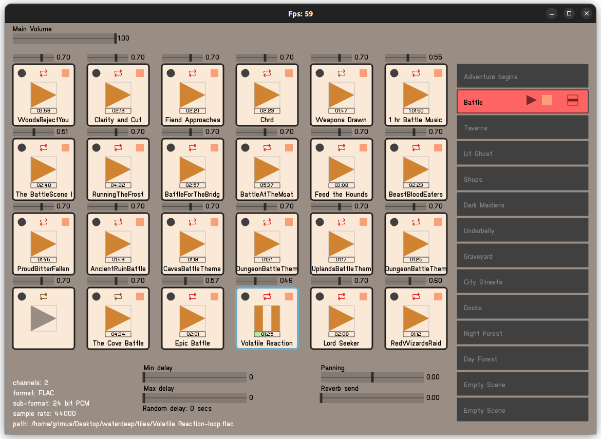

# Feedra
An interative audio atmosphere generator

This software is in development and new features will be incoming.

This software is build using [openFrameworks](https://openframeworks.cc/) and [OpenAL soft](https://www.openal-soft.org/).
It offers the ability to load in samples, as loops or one-shots, and organise them into scenes.

This is meant to be used as an audio tool for TTRPGs, as well as live theatre sounds design, sound installations etc.

Currently built for Linux, with MacOS and Windows in the near future, and possibly Android in the longer term.

Binaries will be soon available for download.

